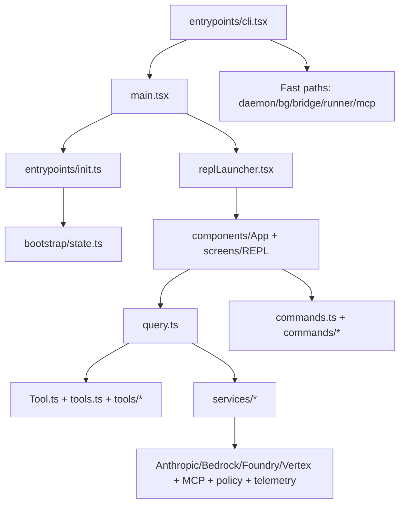

# Architecture Overview

This document maps the high-level architecture of Claude Code from `src/`, focusing on execution modes, subsystem boundaries, and where responsibilities live.

## System shape

Claude Code is a Bun-targeted TypeScript CLI with a layered architecture:

1. Entrypoints and mode dispatch
2. Startup initialization and policy/config/auth wiring
3. Interactive and non-interactive execution surfaces
4. Query/tool orchestration
5. External integrations and platform services

## Runtime modes

- `Interactive REPL`: default UX path through `main.tsx` -> `replLauncher.tsx` -> `screens/REPL.tsx`.
- `Headless/print`: non-interactive mode still shares core query/tool orchestration.
- `Fast-path modes`: `entrypoints/cli.tsx` dispatches specialized modes before loading full CLI.
  - Background session management (`ps`, `logs`, `attach`, `kill`, `--bg`)
  - Bridge/remote-control
  - Daemon worker/supervisor paths
  - MCP-specific server modes
  - Environment/self-hosted runner modes

## Core subsystems

### 1) Entrypoints and bootstrap

- `entrypoints/cli.tsx` is the minimal bootstrap; it intentionally uses dynamic imports and fast exits.
- `main.tsx` is the orchestration center for command parsing, trust/auth checks, and choosing interactive vs non-interactive paths.
- `entrypoints/init.ts` centralizes startup side effects (config enablement, safe env application, shutdown handlers, policy/settings preloads, network transport setup).

### 2) UI and app state

- `replLauncher.tsx` mounts `components/App` + `screens/REPL`.
- `screens/REPL.tsx` is the primary interactive coordinator, connecting input, message rendering, tools, commands, and session state.
- `state/store.ts` implements a lightweight custom store (`getState`, `setState`, `subscribe`) used by app state providers.
- `state/AppState.tsx` provides React context wiring and selective subscriptions.

### 3) Query and tool execution

- `query.ts` owns the turn loop and streaming lifecycle:
  - Message normalization and context assembly
  - API request/stream handling
  - Tool invocation and result stitching
  - Compaction and token-budget pathways
- `Tool.ts` defines tool contracts and execution context (`ToolUseContext`) shared across REPL and SDK/headless paths.
- `tools.ts` is the canonical tool catalog/composition root, with feature-gated and environment-gated inclusion.

### 4) Commands and extensions

- `commands.ts` assembles built-in command definitions and routes to `commands/*`.
- `utils/plugins/pluginLoader.ts` defines plugin discovery/validation/loading and precedence rules.
- Skills and agent definitions are integrated through `skills/*` and `tools/AgentTool/*`.

### 5) Service integrations

- `services/api/client.ts` constructs API clients (Anthropic, Bedrock, Foundry, Vertex) and normalizes auth/header behavior.
- `services/mcp/*` handles MCP connectivity and resources.
- `services/policyLimits/*`, `services/remoteManagedSettings/*`, and `services/analytics/*` provide governance and telemetry services consumed from startup and runtime paths.

## Architectural boundaries

- `src/entrypoints/*` and `main.tsx`: process boot and mode dispatch.
- `src/screens/*`, `src/components/*`, `src/state/*`: interactive presentation and local app state.
- `src/query*`, `src/tools*`, `src/Tool.ts`: agentic runtime orchestration.
- `src/services/*`: external APIs/platform integrations.
- `src/utils/*`: cross-cutting utilities (config, auth, settings, telemetry, shell, permissions, git context).

## Related pages

- [Runtime Flow](runtime-flow.md)
- [Module Map](module-map.md)
- [Design Patterns](design-patterns.md)
- [Architecture Decisions](architecture-decisions.md)
- [Key Capabilities](key-capabilities.md)
