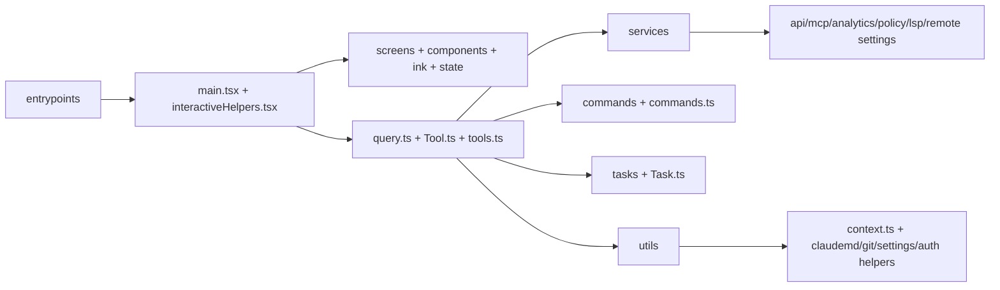

# Module Map

This page maps top-level modules in `src/` to responsibilities and important files.

## Top-level map

## Directory responsibilities

- `entrypoints/`
  - Process entry surfaces (`cli.tsx`, `init.ts`, `mcp.ts`, SDK-facing entrypoints).
  - Decides which runtime path loads.
- `bootstrap/`
  - Session-global runtime state, counters, and shared process-level controls.
- `screens/`, `components/`, `ink/`, `state/`
  - REPL UI, rendering, and app state management.
- `query/` + `query.ts`
  - Query configuration, transitions, budget handling, and streaming loop.
- `tools/` + `tools.ts` + `Tool.ts`
  - Tool definitions, contracts, orchestration, and capability exposure.
- `commands/` + `commands.ts`
  - Slash/interactive command definitions and enablement logic.
- `services/`
  - Integration modules for APIs, MCP, analytics, policy, remote settings, LSP, and related runtime services.
- `utils/`
  - Cross-cutting helpers (config, auth, settings, shell, git, telemetry, permissions, plugin management, swarm backends).
- `plugins/` and `skills/`
  - Bundled extension assets and loading paths.
- `bridge/`, `daemon/`, `environment-runner/`, `self-hosted-runner/`, `remote/`, `server/`
  - Specialized execution modes and remote-control surfaces.
- `types/`, `schemas/`, `constants/`
  - Shared types, validation schemas, and constants used by all layers.
- `tasks/`, `Task.ts`, `tasks.ts`
  - Task abstractions and task state mechanics used by agent workflows.

## Key files by concern

### Boot and orchestration

- `src/entrypoints/cli.tsx`
- `src/main.tsx`
- `src/entrypoints/init.ts`
- `src/interactiveHelpers.tsx`

### Interactive runtime

- `src/replLauncher.tsx`
- `src/screens/REPL.tsx`
- `src/state/AppState.tsx`
- `src/state/store.ts`

### Agent/tool loop

- `src/query.ts`
- `src/query/config.ts`
- `src/Tool.ts`
- `src/tools.ts`

### Extension and command surfaces

- `src/commands.ts`
- `src/commands/*`
- `src/utils/plugins/pluginLoader.ts`
- `src/tools/AgentTool/*`

### Integrations

- `src/services/api/client.ts`
- `src/services/mcp/*`
- `src/services/policyLimits/*`
- `src/services/remoteManagedSettings/*`
- `src/utils/settings/*`

## Notes on module coupling

- `main.tsx` and `screens/REPL.tsx` are high-fan-in orchestration files that import many subsystems.
- `tools.ts` and `commands.ts` are central composition roots for model-visible actions.
- `utils/` provides shared primitives and can become a dependency hotspot; this is expected in the current design.

## Related pages

- [Architecture Overview](architecture-overview.md)
- [Runtime Flow](runtime-flow.md)
- [Design Patterns](design-patterns.md)
