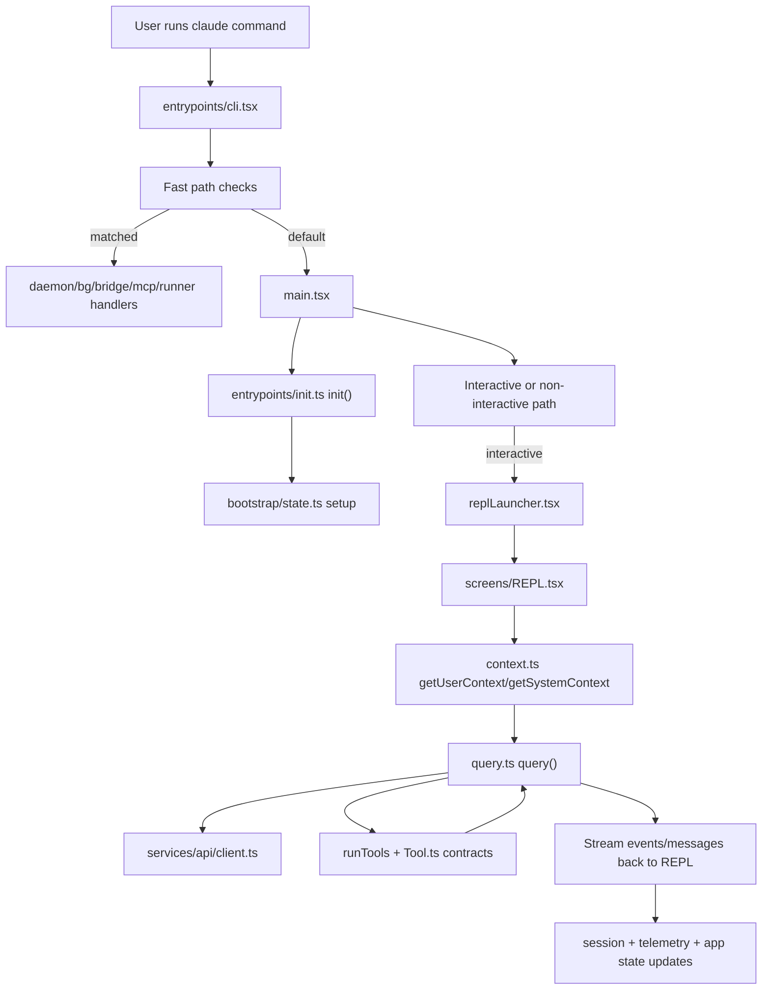

# Runtime Flow

This page describes the end-to-end runtime path from CLI invocation to model/tool turn completion.

## End-to-end sequence

## Startup flow

1. `entrypoints/cli.tsx` reads argv and handles low-cost early exits and fast paths.
2. For standard sessions, it dynamically imports and transfers control to `main.tsx`.
3. `main.tsx` performs top-level startup instrumentation and invokes `init()` from `entrypoints/init.ts`.
4. `init()` enables configuration, applies safe env and network transport settings, initializes long-running promises for remote settings/policy limits, and registers cleanup hooks.
5. Control returns to `main.tsx` to finalize auth/trust/permission setup and choose interactive vs non-interactive execution.

## Interactive session loop

1. `replLauncher.tsx` mounts `App` with `REPL`.
2. `screens/REPL.tsx` prepares:
   - command set from `commands.ts`
   - tool pool from `tools.ts`
   - model/system prompt inputs
   - app/session state handles
3. REPL builds context via `context.ts` (`getSystemContext`, `getUserContext`).
4. REPL invokes `query()` from `query.ts`.
5. `query.ts` iterates until terminal condition:
   - constructs request config and normalized messages
   - streams assistant response chunks
   - detects and executes tool calls via tool orchestration
   - appends tool results and continues
   - applies compaction/token budget rules when needed
6. REPL consumes stream events and updates visible transcript, prompts, progress UI, and persisted session metadata.

## Tool execution lifecycle

1. Model emits tool calls in assistant content.
2. `query.ts` resolves tool handlers by name using `Tool.ts`/`tools.ts` plumbing.
3. Tool handlers execute with `ToolUseContext` (app state callbacks, permission context, MCP clients/resources, session constraints).
4. Tool results are normalized into tool-result messages.
5. `query.ts` reinjects those messages for the next model iteration.

## Non-interactive and specialized flows

- Non-interactive/print paths share the same core query/tool stack, but use non-UI message handling.
- Fast-path command modes in `entrypoints/cli.tsx` bypass full REPL startup to reduce latency and isolate mode-specific concerns.

## Key flow anchors

- `src/entrypoints/cli.tsx`
- `src/main.tsx`
- `src/entrypoints/init.ts`
- `src/replLauncher.tsx`
- `src/screens/REPL.tsx`
- `src/context.ts`
- `src/query.ts`
- `src/Tool.ts`
- `src/tools.ts`
- `src/services/api/client.ts`

## Related pages

- [Architecture Overview](architecture-overview.md)
- [Module Map](module-map.md)
- [Key Capabilities](key-capabilities.md)
